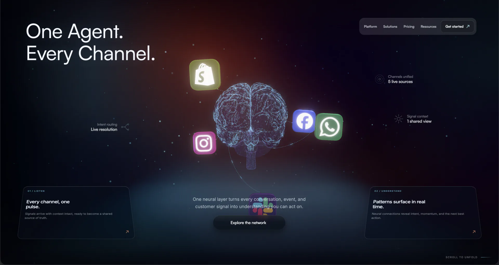

# Synapse

A Vite + TypeScript + Three.js hero scene where platform signals converge on a living neural network.



## Quick start

```bash
npm install
npm run dev
```

Useful checks:

```bash
npm run typecheck       # TypeScript only
npm run build           # Typecheck + production build
npm run optimize:brain  # Rebuild the runtime brain GLB from its source GLB
npm run preview         # Serve the last production build
```

The main experience is served from `index.html`. Add `?debug=1` to enable the development-only
diagnostic panel and renderer/quality overrides.

## Project map

```text
src/
├── scene/       renderer lifecycle, camera, composition, timing, quality, shared types
├── brain/       brain asset loading, topology, materials, anchors
├── badges/      platform badge assets, geometry, orbit actors, validation
├── network/     links and travelling signal packets between badges and brain
├── atmosphere/  fog and ambient particle layers
├── headline/    scene-space headline geometry and animation
├── ui/          DOM hero UI, navigation, scroll/screen anchoring
├── debug/       development-only diagnostics and visibility controls
└── main.ts      application bootstrap and runtime presentation

public/
├── fonts/       local scene typeface data
├── experiments/  standalone visual probes and design studies
├── favicon.svg
└── (no third-party background image; atmosphere is authored CSS)

docs/
├── plans/        implementation and hero-section plans
└── research/     architecture research and reference findings

scripts/
└── optimize-brain.mjs
```

## Ownership rules

- `SceneController` owns the animation loop, renderer lifecycle, resize handling, and shared scene time.
- `CameraRig` is the only writer of camera position, target, and projection.
- `CompositionScaffold` owns the scene graph and coordinates the feature systems.
- `BadgeSystem` owns badge transforms and published sockets.
- `ConnectionSystem` reads badge sockets and brain anchors to build links.
- `PacketSystem` reads the links and samples them for travelling packets.
- `HeroUI` owns DOM-only motion and presentation; it does not write Three.js state.

Keep new behavior inside the feature folder that owns it. Put shared contracts in `src/scene/types.ts`
only when they are genuinely shared across feature folders.

## Assets

The brain asset in `src/new_brain/` is the CC BY 4.0 model [“Brain” by dcreamp on
Sketchfab](https://sketchfab.com/3d-models/brain-c51b432b0b5046c1b4268061b9214feb), processed for
runtime use:

- `source/Brain.glb` is the source asset.
- `runtime/Brain.runtime.glb` is the optimized runtime asset loaded by the application.
- `textures/` contains embedded/source texture data used by the asset pipeline.

Redistributions that include either GLB must retain the attribution and license information in
[`THIRD_PARTY_NOTICES.md`](/Users/khatri_viren/Developer/Projects/brain-animation/THIRD_PARTY_NOTICES.md).

Do not edit the runtime GLB by hand. Update the source asset, then run `npm run optimize:brain`.

See [THIRD_PARTY_NOTICES.md](/Users/khatri_viren/Developer/Projects/brain-animation/THIRD_PARTY_NOTICES.md)
before redistributing the project. In particular, Satoshi is delivered through Fontshare’s official
CSS endpoint rather than bundled in `public/`, because its ITF Free Font License restricts public
font-file serving without written consent.

## Licensing

Original Synapse source code is licensed under the [MIT License](LICENSE). Third-party materials
retain their own licenses; the brain model is licensed under [CC BY 4.0](LICENSES/CC-BY-4.0.md),
and all known third-party software, fonts, references, and assets are documented in
[`THIRD_PARTY_NOTICES.md`](/Users/khatri_viren/Developer/Projects/brain-animation/THIRD_PARTY_NOTICES.md).

## Browser fallback

The renderer prefers WebGPU and falls back through Three.js to WebGL2. If neither backend is
available, the page exposes the static accessible poster in `index.html`.

## Experiments and working notes

Standalone visual probes are available while the dev server is running:

- `/experiments/glass-probe.html`
- `/experiments/grain-gradient-demo.html`
- `/experiments/colorflow-replica.html`

Planning and research live under `docs/` so the repository root stays focused on the application
entry point, package configuration, and project-level documentation.
